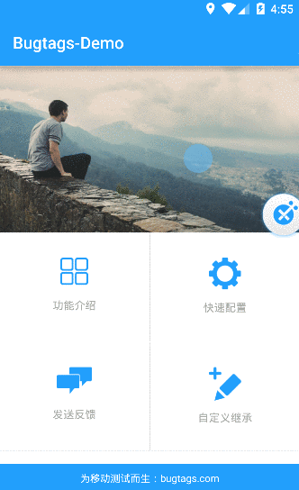

Bugtags Android SDK
===================
###中文文档请移步[README_CN](https://github.com/bugtags/Bugtags-Android/blob/dev/README_CN.md)
###QQ tribe for help: 479166560

[Bugtags] for Android, reports bugs and their diagnosis information in one step, captures crashes automatically. Improve your apps anywhere, anytime.

[Create a free account](http://bugtags.com/) and invite your team to improve your apps.
> If you are using Eclipse for Android development, visit [SDK for Eclipse] to download SDK

# Features
1. Take snapshot of bug, add tags to describe the bug.
2. Automatically collect device and app context data when reporting bugs.
3. Automatically capture crashes.
4. Bug lifecycle management.

# Installation:
### Gradle
* 1.The SDK is available through Maven Central. In your build.gradle file, add the following dependency, then sync your gradle files:
```gradle
compile 'com.bugtags.library:bugtags-lib:1.0.1'
```
* 2.Then initialize Bugtags in your application’s onCreate() method:
```java
Bugtags.start("YOUR APPKEY", this, Bugtags.BTGInvocationEventBubble);
```
* 3.Change your base activity to extend one of the following activities, to enable automatically tracking user steps:
```java
 BugtagsAppCompatActivity: This extends android.support.v7.app.AppCompatActivity
 BugtagsActionBarActivity: This extends android.support.v7.app.ActionBarActivity
 BugtagsActivity: This extends android.app.activity
 BugtagsFragmentActivity: This extends android.support.v4.app.FragmentActivity
```
  *or invoke the callbacks manually:*
  ```java
        package your.package.name;
        import android.app.Activity;
        import android.os.Bundle;
        import android.view.MotionEvent;

        import com.bugtags.library.Bugtags;

        public class CustomActivity extends Activity{
            @Override
            protected void onCreate(Bundle savedInstanceState) {
                super.onCreate(savedInstanceState);
                Bugtags.onCreate(this);
            }

            @Override
            protected void onResume() {
                super.onResume();
                Bugtags.onResume(this);
            }

            @Override
            protected void onPause() {
                super.onPause();
                Bugtags.onPause(this);
            }

            @Override
            protected void onDestroy() {
                super.onDestroy();
                Bugtags.onDestroy(this);
            }

            @Override
            public boolean dispatchTouchEvent(MotionEvent event) {
                Bugtags.onDispatchTouchEvent(this, event);
                return super.dispatchTouchEvent(event);
            }
        }
  ```
  For more information about Android Studio and gradle, please visit: [Android Developer Site].

# Usage:



[SDK for Eclipse]:https://github.com/bugtags/Bugtags-Android-Eclipse
[Bugtags]:http://bugtags.com
[Android Developer Site]:http://developer.android.com/tools/studio/index.html
